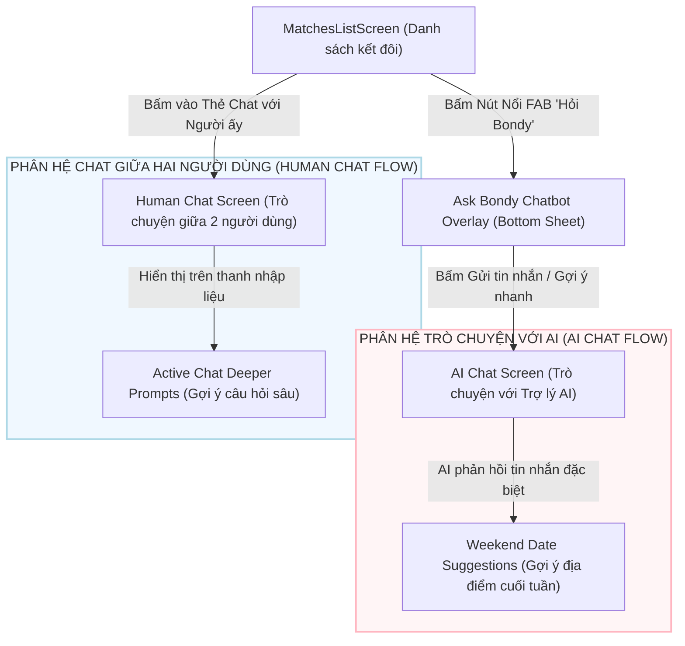

# Đặc tả Thiết kế: Tái cấu trúc Danh sách kết đôi & Tích hợp Tính năng Gợi ý AI

Tài liệu này đặc tả chi tiết kế hoạch thiết kế và triển khai tái cấu trúc màn hình Danh sách kết đôi cùng với các tính năng Gợi ý AI (AI Assistant, AI Icebreakers, Deeper Prompts, Weekend Date Suggestions) trong Bondy App. Thiết kế này tách biệt rõ ràng giữa hai phân hệ độc lập: **Trò chuyện với AI (AI Chat Flow)** và **Trò chuyện giữa 2 người dùng (Human-to-Human Chat Flow)**.

---

## 1. Tổng quan & Trải nghiệm Người dùng (UX Overview)

Mục tiêu chính là mang lại một giao diện hiện đại, trực quan, tăng tỷ lệ giữ chân người dùng thông qua các tính năng hỗ trợ bằng trí tuệ nhân tạo (AI) thầm lặng và tinh tế:

*   **Danh sách kết đôi hiện đại hơn:** Tích hợp ô tìm kiếm, chuyển đổi phần lượt kết đôi chờ xác nhận từ thẻ dọc thành hàng tròn cuộn ngang, chuyển đổi lối vào trợ lý AI thành nút nổi FAB.
*   **AI Trợ lý riêng tư (Ask Bondy Chatbot Overlay):** Cung cấp lối vào nhanh qua Bottom Sheet, tạo không gian an toàn để tâm sự với AI Coach.
*   **Gợi ý hẹn hò cuối tuần (Weekend Date Suggestions):** Tích hợp sâu dưới dạng thẻ Card cuộn ngang đồ họa trực quan sinh động bên trong phòng chat riêng tư của Trợ lý AI.
*   **Phá băng hội thoại (Active Chat Deeper Prompts & Icebreakers):** Cung cấp các câu gợi ý mở lời ngay trong danh sách tin nhắn của cuộc trò chuyện mới, và hiển thị thanh gợi ý câu hỏi sâu trên thanh nhập liệu phòng chat đôi giúp người dùng gửi cho nhau dễ dàng.

---

## 2. Kiến trúc & Sự Phân Tách Hệ Thống (Architecture & Separation)

Để đảm bảo tính độc lập và sạch sẽ của mã nguồn, hai luồng trò chuyện được tách biệt hoàn toàn về cả giao diện và luồng dữ liệu:



### 2.1 Phân hệ 1: Trò chuyện với AI (AI Chat Flow)
*   **Mục đích:** Người dùng tâm sự và nhận lời khuyên riêng tư từ trợ lý Bondy AI.
*   **Trình hiển thị gợi ý hẹn hò:** Chatbot AI phân tích cuộc trò chuyện riêng tư của người dùng $\rightarrow$ Tự động gửi tin nhắn loại đặc biệt (`DATE_SUGGESTION`) chứa JSON $\rightarrow$ Render thành **hàng thẻ Card địa điểm cuộn ngang trực tiếp trong bong bóng chat** (The Hideout Cafe, Pizza 4P's...).
*   **Mã nguồn tác động:** `lib/screens/chat/healing_chatbot_coach_screen.dart` và widget chat bubble tương ứng.

### 2.2 Phân hệ 2: Trò chuyện giữa 2 người dùng (Human Chat Flow)
*   **Mục đích:** Hai người dùng thật trò chuyện riêng tư với nhau.
*   **Hỗ trợ AI thầm lặng:** Hiển thị dải câu hỏi sâu sắc (Deeper Prompts) cuộn ngang ngay phía trên bàn phím. Khi bấm chọn, câu hỏi được điền sẵn vào ô nhập tin nhắn để người dùng chỉnh sửa trước khi chủ động nhấn gửi. AI tuyệt đối không can thiệp trực tiếp vào bong bóng chat của hai người.
*   **Mã nguồn tác động:** `lib/screens/chat/chat_screen.dart`.

---

## 3. Đặc tả Thành phần Giao diện & Xử lý Logic (UI & Logic Specification)

### 3.1 Màn hình Danh sách kết đôi (`MatchesListScreen`)
Chúng ta sửa đổi tập tin [matches_list_screen.dart](file:///c:/Users/THANGND/EXE_Project/bondy_app/lib/screens/chat/matches_list_screen.dart):

1.  **Thanh tìm kiếm (`_buildSearchField`):**
    *   Sử dụng `TextField` với bo góc `16dp`, màu nền xám nhạt `BondyColors.background`.
    *   Icon `Icons.search` màu xám ở đầu, gợi ý hiển thị *"Tìm kiếm người ấy..."*.
    *   Logic lọc danh sách tin nhắn: Liên kết với sự kiện thay đổi văn bản để lọc trực tiếp mảng `_chats` theo thuộc tính `displayName`.
2.  **Mới tương hợp cuộn ngang (`_buildHorizontalPendingList`):**
    *   Chuyển đổi `_pendingMatches` từ danh sách dọc sang hàng cuộn ngang:
        ```dart
        Widget _buildHorizontalPendingList() {
          return SizedBox(
            height: 105,
            child: ListView.builder(
              scrollDirection: Axis.horizontal,
              itemCount: _pendingMatches.length,
              itemBuilder: (context, index) {
                final match = _pendingMatches[index];
                return _buildPendingAvatarTile(match);
              },
            ),
          );
        }
        ```
    *   Mỗi avatar có đường kính `66dp` nằm trong Container viền gradient rực rỡ đại diện cho lượt tương hợp mới chờ xác nhận.
3.  **Nút FAB nổi Hỏi Bondy AI:**
    *   Bổ sung thuộc tính `floatingActionButton` của `Scaffold`:
        ```dart
        floatingActionButton: FloatingActionButton(
          onPressed: () => _showAskBondyOverlay(context),
          backgroundColor: Colors.transparent,
          elevation: 4,
          child: Container(
            width: 56,
            height: 56,
            decoration: const BoxDecoration(
              shape: BoxShape.circle,
              gradient: BondyColors.primaryGradient,
            ),
            child: const Icon(Icons.smart_toy, color: Colors.white, size: 28),
          ),
        )
        ```
4.  **AI Icebreaker trong danh sách tin nhắn (`_buildChatTile`):**
    *   Nếu cuộc trò chuyện mới tinh (`chat.lastMessage == null`), chúng ta hiển thị câu gợi ý phá băng ngẫu nhiên từ kho ngữ liệu:
        *   Icon bông hoa 🌸 (`Icons.local_florist`).
        *   Text nghiêng màu hồng dịu: *"Gợi ý mở lời: 'Cuối tuần của bạn thường diễn ra như thế nào?'"*.

### 3.2 Bottom Sheet Trợ lý AI (`AskBondyChatbotOverlay`)
Triển khai một Bottom Sheet kéo lên từ dưới thông qua hàm `showModalBottomSheet`:
*   **Header:** Tiêu đề lớn "Bondy AI", dòng phụ màu gradient thương hiệu *"LẮNG NGHE & THẤU HIỂU"*. Nút đóng hình tròn xám ở góc phải.
*   **Thẻ Chào mừng AI:** Sử dụng `Transform.rotate(angle: 0.05)` để xoay nghiêng thẻ 3 độ. Thẻ có nền gradient thương hiệu rực rỡ, chứa icon lấp lánh `Icons.auto_awesome` và lời chào thấu cảm.
*   **3 Nút Gợi ý nhanh (Prompt Buttons):** Thiết kế dạng các nút bấm bo góc lớn, nền màu Pastel dịu mát.
    *   *Làm sao để mở đầu câu chuyện?* (Nền xanh nhạt)
    *   *Hôm nay mình thấy hơi mệt mỏi.* (Nền tím nhạt)
    *   *Tư vấn về mục tiêu yêu đương.* (Nền hồng nhạt)
    *   Khi người dùng nhấn vào nút này hoặc gửi nội dung gõ thủ công, Bottom Sheet sẽ đóng lại và điều hướng chính xác sang phòng chat AI (`/chatbot`), tự động kích hoạt gửi tin nhắn ban đầu này lên API trợ lý AI để nhận phản hồi ngay lập tức.

### 3.3 Phòng chat Trợ lý AI (`HealingChatbotCoachScreen`)
*   **Weekend Date Suggestions:** Khi nhận được tin nhắn đề xuất địa điểm, tin nhắn có loại dữ liệu đặc biệt `DATE_SUGGESTION` sẽ render ra hàng thẻ cuộn ngang trực tiếp trong bong bóng chat.
*   Mỗi thẻ địa điểm rộng `280dp` bao gồm ảnh nền sắc nét, nhãn phân loại (Cafe, Dinner, Outdoor), khoảng cách (1.2km), vibe tag ("Yên tĩnh", "Lãng mạn"), thanh nổi bật lấp lánh *"Phù hợp với vibe của hai bạn"* cùng 3 nút chức năng tương tác: **Chia sẻ (Share)**, **Lưu (Save)**, **Xem bản đồ (Map)**.

### 3.4 Phòng chat Người dùng với nhau (`ChatScreen`)
*   **AI Suggestion Bar:** Chứa danh sách cuộn ngang các thẻ Chip bo góc tròn, viền mỏng nằm ngay trên bàn phím.
*   Chứa các câu hỏi sâu sắc: *"Điều gì khiến bạn thấy thoải mái nhất khi ở bên một người?"*, *"Kỷ niệm đáng nhớ gần đây?"*...
*   Khi nhấn vào chip gợi ý, văn bản câu hỏi được chèn vào ô nhập tin nhắn `_controller.text = selectedPrompt;`, bàn phím tự động mở ra và con trỏ chuột di chuyển xuống cuối văn bản để người dùng xem lại trước khi bấm gửi.

---

## 4. Kế hoạch Kiểm thử & Xác thực (Verification Plan)

### 4.1 Kiểm thử Thủ công (Manual Scenarios)
1.  **Kiểm thử Danh sách kết đôi:**
    *   Nhập từ khóa tìm kiếm $\rightarrow$ Lọc tin nhắn chính xác.
    *   Hàng cuộn ngang mới tương hợp $\rightarrow$ Hiển thị đầy đủ avatar tròn viền gradient, bấm vào chuyển sang `/match-confirm` kèm tham số.
    *   Nhập vào nút FAB "Hỏi Bondy" ở góc phải $\rightarrow$ Mở chính xác Bottom Sheet.
2.  **Kiểm thử Bottom Sheet:**
    *   Renders đầy đủ tiêu đề, nút đóng, thẻ nghiêng gradient và 3 nút câu hỏi nhanh.
    *   Bấm nút câu hỏi nhanh $\rightarrow$ Tự đóng sheet $\rightarrow$ Mở phòng chat AI `/chatbot` $\rightarrow$ Tự động gửi câu hỏi đó đi.
3.  **Kiểm thử Phòng chat người dùng:**
    *   Hiển thị dải Chip gợi ý câu hỏi sâu trên thanh nhập liệu.
    *   Bấm một Chip $\rightarrow$ Tự động điền vào ô nhập văn bản $\rightarrow$ Bàn phím vẫn mở và con trỏ nhấp nháy ở cuối dòng văn bản.
4.  **Kiểm thử gợi ý hẹn hò:**
    *   Mở phòng chat AI, chatbot phản hồi đề xuất $\rightarrow$ Hiển thị chính xác hàng thẻ Card địa điểm cuộn ngang đẹp mắt thay vì văn bản JSON thô.

### 4.2 Kiểm thử Tự động (Linting & Static Analysis)
Chạy lệnh kiểm tra linter tĩnh để đảm bảo mã nguồn sạch sẽ 100%:
```bash
flutter analyze
```

---

> [!NOTE]
> Giao diện mới sử dụng font chữ Google Fonts `Plus Jakarta Sans` cùng với các hằng số màu sắc chuẩn xác từ `BondyColors` để mang lại trải nghiệm thị giác cao cấp nhất.
