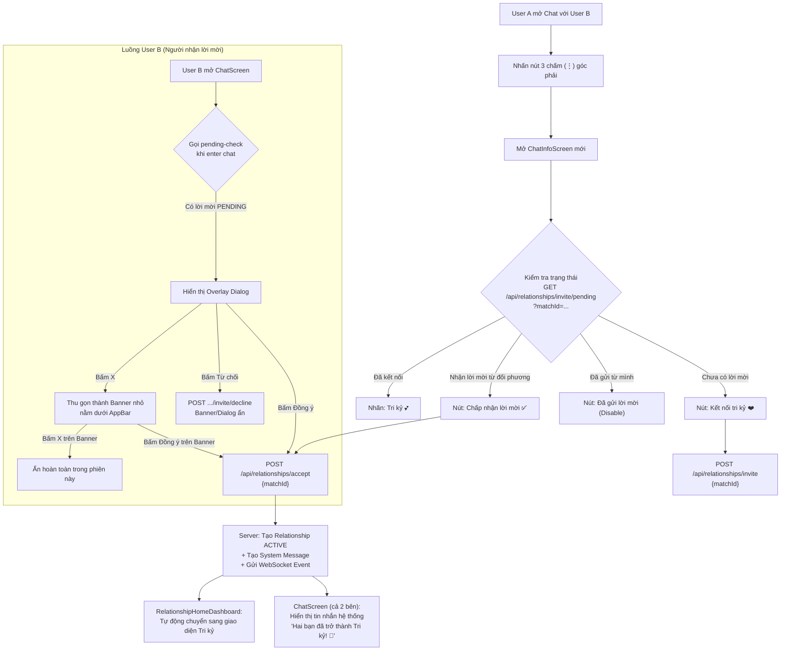

# Đặc tả Thiết kế: Xác nhận Mời Mối Quan Hệ (Tri Kỷ)
**Ngày:** 2026-06-03  
**Phiên bản:** v1.0  
**Trạng thái:** ✅ Đã Duyệt  
**Liên quan đến phiên chat:** `36820eb6-bd2e-4264-86f1-f0452996edb9` (27/05/2026)

---

## 1. Tổng quan & Mục tiêu (Overview)

Tài liệu này đặc tả toàn bộ thiết kế kỹ thuật và giao diện cho tính năng **Xác nhận Mời Mối Quan Hệ Tri Kỷ** trong ứng dụng Bondy. Tính năng này cho phép hai người dùng đã match nhau có thể nâng cao mức độ kết nối từ "tương hợp" (Match) lên "Tri kỷ" (Soulmate/Intimate Partner) — mở khoá toàn bộ tính năng cặp đôi trong tab "Của chúng mình".

### Bối cảnh kỹ thuật
- Sự kiện mutual match được phát hiện qua log: `mutual-match-detected` (sau khi hai người swipe LIKE chéo nhau).
- Hệ thống hiện có: `RelationshipInvitationScreen` dùng cơ chế **mã mời** (invite code). Tính năng mới sẽ **loại bỏ hoàn toàn** cơ chế nhập code, thay bằng luồng Native In-App trực tiếp qua `matchId`.
- File hiện có sẽ được **thay thế/nâng cấp** theo spec này.

---

## 2. Sơ đồ Luồng Hệ Thống (System Flow)



---

## 3. Thiết kế Backend & Database (`bondy_server`)

### 3.1 Cơ sở dữ liệu (`prisma/schema.prisma`)

Bảng `RelationshipInvitation` **không thay đổi cấu trúc**, nhưng cơ chế sử dụng được đơn giản hoá:

| Field | Type | Ghi chú |
|:---|:---|:---|
| `id` | String | PK tự động |
| `inviterId` | String | ID người gửi lời mời |
| `inviteeId` | String | ID người nhận lời mời (lấy từ match) |
| `matchId` | String | **Khóa chính để tra cứu** (thay thế inviteCode) |
| `status` | Enum | `PENDING` | `ACCEPTED` | `REJECTED` |
| `inviteCode` | String | Vẫn tự tạo ngầm trên server (không hiển thị ra UI) |

> [!IMPORTANT]
> Field `inviteCode` vẫn được tạo tự động trên server cho tính tương thích nội bộ, nhưng sẽ **không bao giờ hiển thị** ra giao diện người dùng nữa. Xoá toàn bộ UI liên quan đến mã nhập code.

### 3.2 API Endpoints (tất cả nằm trong `/api/relationships/`)

#### `POST /api/relationships/invite` — Tạo lời mời mới
```typescript
// Body
{ matchId: string }

// Logic
// 1. Dùng matchId để tìm đối phương (inviteeId)
// 2. Kiểm tra nếu đã có Relationship ACTIVE hoặc lời mời PENDING → trả lỗi 409
// 3. Tạo RelationshipInvitation { status: 'PENDING', matchId }
// 4. Trả về { invitationId, status }
```

#### `GET /api/relationships/invite/pending?matchId=...` — Kiểm tra lời mời
```typescript
// Query
matchId: string

// Trả về
// Nếu có lời mời PENDING → { invitation: { id, inviterId, inviterName, inviterPhoto, status } }
// Nếu không → { invitation: null }
// Nếu đã kết nối → { relationship: { id, status: 'ACTIVE', startDate } }
```

#### `POST /api/relationships/accept` — Chấp nhận lời mời
```typescript
// Body
{ matchId: string }

// Logic
// 1. Tìm lời mời PENDING có matchId & inviteeId = currentUser
// 2. Đổi status → ACCEPTED
// 3. Tạo/Kích hoạt Relationship { status: ACTIVE }
// 4. Tạo System Message vào bảng Message:
//    { content: '💕 Hai bạn đã chính thức trở thành Tri kỷ!', messageType: 'SYSTEM' }
// 5. Gửi WebSocket event ChatRealtimeEvent { kind: 'relationship_accepted', data: {...} }
// 6. Gửi Push Notification cho inviter (User A)
```

#### `POST /api/relationships/invite/decline` — Từ chối lời mời
```typescript
// Body
{ matchId: string }

// Logic
// 1. Tìm lời mời PENDING có matchId & inviteeId = currentUser
// 2. Đổi status → REJECTED
// 3. Gửi Push Notification nhẹ cho inviter (tuỳ chọn, không bắt buộc)
```

---

## 4. Thiết kế Giao diện Mobile App (`bondy_app`)

### Nguyên tắc thiết kế tổng quát
- **Theme:** Light Mode ấm áp — nền `HealingStitchColors.warmBackground` (`#FFF9F5`)
- **Font:** `Plus Jakarta Sans` (`google_fonts`)  
- **Màu chính:** Gradient Bondy `#FF7E5F → #FF4B8B`
- **Bo góc:** `16dp` cho card, `24dp` cho container lớn, `pill` (vô cực) cho button chính

---

### 4.1 Màn hình Mutual Match mới — `MatchSuccessScreen`

**Thay thế:** `match_confirmation_screen.dart` hiện tại (vẫn giữ file nhưng nâng cấp giao diện)  
**Route:** `/match-confirm` (không đổi)  
**Trigger:** Sau khi swipe LIKE và server phát hiện `mutual-match`

#### Bố cục màn hình (390×884 dp)
```
┌──────────────────────────────────────┐
│  [Safe Area - Top]                   │
│                                      │
│  ╔════════════════════════════════╗  │
│  ║  Background: Gradient sáng     ║  │
│  ║  (#FFF9F5 → #FFE8F0, 45°)      ║  │
│  ║                                ║  │
│  ║    🎊 [Confetti animation]     ║  │
│  ║                                ║  │
│  ║    [Avatar User] ❤️ [Avatar B]  ║  │  ← 2 circle ảnh có pulsing glow
│  ║      ← 88dp →  ← 88dp →       ║  │
│  ║                                ║  │
│  ║    ✨ Tương hợp thành công! ✨   ║  │  ← Font 26sp Bold
│  ║                                ║  │
│  ║  "Bạn và [Tên] đã kết nối!     ║  │
│  ║   Hãy bắt đầu trò chuyện       ║  │
│  ║   để hiểu nhau hơn nhé 💫"     ║  │  ← Font 14sp Regular, màu xám
│  ║                                ║  │
│  ║  [Nhóm điểm tương thích]       ║  │  ← Chip: 87% phù hợp, 3 items
│  ╚════════════════════════════════╝  │
│                                      │
│  ┌──────────────────────────────┐    │
│  │  💬 Trò chuyện ngay          │    │  ← Gradient button, border-radius pill
│  └──────────────────────────────┘    │
│                                      │
│    Tiếp tục khám phá →               │  ← Text button, màu xám
│                                      │
│  [Safe Area - Bottom]                │
└──────────────────────────────────────┘
```

#### Chi tiết Component

**Cặp Avatar (AvatarPair):**
- 2 `CircleAvatar` radius 44dp đặt chồng lên nhau (offset -20dp theo chiều ngang)
- Viền ngoài: `Border` 3dp, màu trắng
- `AnimatedContainer` tạo hiệu ứng `pulsing glow`: `BoxShadow` với `alpha` dao động 0.2 → 0.6, chu kỳ 1.5s
- Trái tim ❤️ nằm ở điểm giao nhau giữa 2 avatar, `Container` 36dp màu `BondyColors.primary`

**Confetti:**
- Dùng package `confetti: ^0.7.0` (thêm vào `pubspec.yaml`)
- `ConfettiController` tự động chạy khi màn mở
- Màu: `[Color(0xFFFF4B8B), Color(0xFFFF8A6C), Color(0xFFFFD700), Color(0xFF20DF60)]`

**Nút "Trò chuyện ngay":**
```dart
DecoratedBox(
  decoration: BoxDecoration(
    gradient: HealingStitchColors.warmGradient, // #FF7E5F → #FF4B8B
    borderRadius: BorderRadius.circular(100),
    boxShadow: [BoxShadow(color: BondyColors.primary.withOpacity(0.35), blurRadius: 16, offset: Offset(0, 6))],
  ),
  child: ElevatedButton(...),
)
```

---

### 4.2 Màn hình Thông tin Cuộc Trò Chuyện — `ChatInfoScreen` [MỚI]

**File mới:** `lib/screens/chat/chat_info_screen.dart`  
**Mở từ:** Nút 3 chấm (⋮) trong `ChatScreen` → thay thế `_showMoreOptions()` hiện tại  
**Route:** `/chat/info` hoặc mở bằng `Navigator.push` không qua route

#### Bố cục màn hình

```
┌──────────────────────────────────────┐
│  AppBar: "Thông tin" [← Back]        │
│  Background: warmBackground          │
├──────────────────────────────────────┤
│                                      │
│  ┌──────────────────────────────┐    │
│  │   HEADER SECTION             │    │
│  │   Avatar tròn lớn (72dp)     │    │  ← CircleAvatar + viền gradient
│  │   ● Tên đối phương (18sp 700)│    │
│  │   ○ Đang hoạt động / X phút  │    │  ← Chấm xanh hoặc xám
│  └──────────────────────────────┘    │
│                                      │
│  ┌──────────────────────────────┐    │
│  │  QUICK ACTIONS ROW           │    │
│  │  [❤️ Tri kỷ] [🔔 Thông báo]  │    │  ← Icon + label, 3 nút ngang
│  │  [🔍 Tìm kiếm]               │    │
│  └──────────────────────────────┘    │
│                                      │
│  ┌──────────────────────────────┐    │
│  │  MENU LIST                   │    │
│  │  📎 File & phương tiện        │    │
│  │  📌 Tin nhắn đã ghim          │    │
│  │  ─────────────────────────── │    │
│  │  🚫 Bỏ kết nối (unmatch)      │    │  ← Màu đỏ/cảnh báo
│  │  ⛔ Chặn người dùng           │    │  ← Màu đỏ/cảnh báo
│  └──────────────────────────────┘    │
│                                      │
└──────────────────────────────────────┘
```

#### Nút Tri Kỷ — 4 trạng thái động

| Trạng thái | Giao diện | Action khi nhấn |
|:---|:---|:---|
| **NONE** — Chưa gửi lời mời | Icon ❤️ (outline) + Text "Kết nối tri kỷ" | Gọi `POST /invite` → chuyển sang trạng thái SENT |
| **SENT** — Đã gửi từ mình | Icon ❤️ (filled, mờ) + Text "Đã gửi lời mời" | Disable (hoặc tuỳ chọn Huỷ) |
| **RECEIVED** — Nhận lời mời từ đối phương | Icon ❤️ (filled, cam sáng) + Text "Chấp nhận lời mời" | Gọi `POST /accept` → snackbar "Đã trở thành Tri kỷ!" |
| **ACTIVE** — Đã kết nối Tri kỷ | Icon 💕 + Text "Tri kỷ" | Không làm gì / mở RelationshipDashboard |

**Dart Enum:**
```dart
enum RelationshipInviteStatus { none, sent, received, active }
```

#### Loading states
- Khi vào màn: `CircularProgressIndicator` nhỏ ở khu vực quick actions
- Sau khi load: Hiển thị đúng trạng thái nút Tri kỷ

---

### 4.3 Hệ thống Lời Mời trong `ChatScreen`

**Khi User B vào ChatScreen**, gọi ngầm:
```dart
Future<void> _checkPendingInvite() async {
  final matchId = _matchId;
  if (matchId == null) return;
  final result = await _relationshipService.checkPendingInvite(matchId);
  if (!mounted) return;
  if (result.hasPendingInvite) {
    setState(() => _pendingInvite = result.invitation);
    _showInviteDialog();
  }
}
```

#### 4.3.1 Overlay Dialog (Pop-up lời mời)

```
╔═══════════════════════════════════════╗
║  [X ở góc phải]                      ║
║                                       ║
║  [Avatar Người A, 48dp]               ║
║                                       ║
║  💌 "[Tên A] gửi lời mời kết nối      ║
║      Tri kỷ đến bạn.                  ║
║      Hãy cùng nhau chia sẻ hành      ║
║      trình nhé!"                      ║
║                                       ║
║  ┌────────────┐  ┌────────────┐      ║
║  │  Từ chối   │  │  Đồng ý ❤️│      ║
║  └────────────┘  └────────────┘      ║
╚═══════════════════════════════════════╝
```

- Dialog bo góc `24dp`, nền trắng kem `#FFFAF8`
- Avatar User A hiển thị tại đỉnh dialog
- Nút **"Đồng ý"**: Gradient fill, icon ❤️ → Gọi `POST /accept`
- Nút **"Từ chối"**: Outline, màu xám → Gọi `POST /decline` → Dialog ẩn hẳn
- Nút **[X]**: Chỉ đóng Dialog tạm thời → Hiển thị **Collapsed Banner**

#### 4.3.2 Banner Thu Gọn (Collapsed Banner)

Xuất hiện ngay dưới `AppBar` khi User B đóng Dialog tạm thời bằng [X]:

```dart
// Đặt trong Stack hoặc Column bên trong body của ChatScreen
AnimatedContainer(
  duration: Duration(milliseconds: 300),
  height: _showCollapsedBanner ? 48 : 0,
  child: Container(
    color: Color(0xFFFFF0F5), // Hồng nhạt ấm
    padding: EdgeInsets.symmetric(horizontal: 16, vertical: 8),
    child: Row(
      children: [
        Icon(Icons.favorite_border, size: 16, color: BondyColors.primary),
        SizedBox(width: 8),
        Expanded(child: Text('Lời mời Tri kỷ từ [Tên] đang chờ...', ...)),
        TextButton(onPressed: _acceptInvite, child: Text('Đồng ý')),
        IconButton(icon: Icon(Icons.close, size: 16), onPressed: _hideBanner),
      ],
    ),
  ),
)
```

- Khi bấm **"Đồng ý"** trên banner → Gọi `POST /accept`
- Khi bấm **[X]** trên banner → `_showCollapsedBanner = false` (ẩn trong phiên này, không gọi API decline)

---

### 4.4 Tin nhắn Hệ Thống — System Message Bubble

Trong `ChatScreen._buildBubble()`, thêm case xử lý:
```dart
if (message.messageType == 'SYSTEM') {
  return _buildSystemMessageBubble(message);
}
```

#### Thiết kế System Message Bubble
```
         ─── 💕 Hai bạn đã chính thức trở thành Tri kỷ! ───
```

- Canh giữa hoàn toàn (không có avatar, không có bong bóng chat màu)
- Container: Bo góc `100dp` (pill shape), nền `Color(0xFFFFF0F5)` (hồng nhạt)
- Padding: `8dp` dọc, `16dp` ngang
- Text: `12sp`, màu `BondyColors.textSecondary`, dùng `maxLines: 2`
- Không có timestamp hiển thị

---

## 5. Danh sách File Thay đổi (Change List)

### `bondy_app`

| File | Thao tác | Nội dung thay đổi |
|:---|:---|:---|
| `lib/screens/match/match_confirmation_screen.dart` | **[MODIFY]** | Nâng cấp UI toàn bộ: Light theme, gradient, confetti, pulsing avatar, đổi nút thành "Trò chuyện ngay" + "Tiếp tục khám phá" |
| `lib/screens/chat/chat_info_screen.dart` | **[NEW]** | Màn hình Chat Info mới với 4 trạng thái nút Tri kỷ, quick actions, menu list |
| `lib/screens/chat/chat_screen.dart` | **[MODIFY]** | Thêm: `_checkPendingInvite()` khi bootstrap, `_buildInviteDialog()`, `_buildCollapsedBanner()`, `_buildSystemMessageBubble()`. Sửa: `_showMoreOptions()` → navigate sang ChatInfoScreen |
| `lib/screens/relationship/relationship_invitation_screen.dart` | **[MODIFY]** | Xoá toàn bộ giao diện nhập/hiển thị invite code. Thay bằng màn loading redirect sang ChatInfoScreen |
| `lib/services/relationship_service.dart` | **[NEW hoặc MODIFY]** | Thêm các method: `sendInvite(matchId)`, `checkPendingInvite(matchId)`, `acceptInvite(matchId)`, `declineInvite(matchId)` |
| `lib/main.dart` | **[MODIFY]** | Thêm route `/chat/info` → `ChatInfoScreen` |
| `pubspec.yaml` | **[MODIFY]** | Thêm dependency `confetti: ^0.7.0` |

### `bondy_server`

| File | Thao tác | Nội dung thay đổi |
|:---|:---|:---|
| `src/app/api/relationships/invite/route.ts` | **[MODIFY]** | Thêm logic tạo lời mời qua matchId, loại bỏ bước nhập/xác minh inviteCode |
| `src/app/api/relationships/invite/pending/route.ts` | **[NEW]** | Endpoint `GET ?matchId=...` kiểm tra lời mời PENDING |
| `src/app/api/relationships/invite/decline/route.ts` | **[NEW]** | Endpoint `POST` từ chối lời mời |
| `src/app/api/relationships/accept/route.ts` | **[MODIFY]** | Cập nhật: accept qua matchId (không cần inviteCode), tạo System Message, gửi WebSocket event |
| `src/service/relationship.service.ts` | **[MODIFY]** | Refactor logic accept/decline, thêm `buildSystemMessage()`, thêm WebSocket broadcast |

---

## 6. Luồng Dữ liệu Thời gian Thực (Realtime Flow)

Khi User B bấm **"Đồng ý"**:

```
Client B → POST /accept
         ↓
Server   → Cập nhật DB (Relationship ACTIVE)
         → INSERT System Message vào bảng Message
         → WebSocket broadcast: { kind: 'relationship_accepted', matchId, ... }
         ↓
Client A ← Nhận WebSocket event
         → Thêm System Message vào danh sách tin nhắn
         → Cập nhật ChatInfoScreen: nút Tri kỷ chuyển sang trạng thái ACTIVE
         → Toast: "💕 [Tên B] đã chấp nhận lời mời Tri kỷ!"

Client B ← Nhận WebSocket event (từ server xác nhận)
         → Thêm System Message vào danh sách tin nhắn
         → Dialog/Banner ẩn hoàn toàn
         → Toast: "🎉 Bạn và [Tên A] đã trở thành Tri kỷ!"
```

**Xử lý trong `_handleRealtimeEvent()` của `ChatScreen`:**
```dart
case ChatRealtimeEventKind.relationshipAccepted:
  final systemMsg = ChatMessage.fromJson(event.data['systemMessage']);
  setState(() => _messages.add(systemMsg));
  setState(() {
    _showInviteDialog = false;
    _showCollapsedBanner = false;
    _relationshipStatus = RelationshipInviteStatus.active;
  });
  _scrollToBottom();
  BondyFeedback.showSuccess(context, '💕 Hai bạn đã trở thành Tri kỷ!');
  break;
```

---

## 7. Kế hoạch Kiểm thử (Verification Plan)

### Automated Tests
```bash
# Flutter analysis
cd c:\Users\THANGND\EXE_Project\bondy_app
flutter analyze

# Server type check
cd c:\Users\THANGND\EXE_Project\bondy_server
npm run type-check
```

### Manual Test Scenarios

| # | Kịch bản | Bước thực hiện | Kết quả mong đợi |
|:--|:---|:---|:---|
| T1 | Gửi lời mời | User A nhấn ⋮ → Chat Info → "Kết nối tri kỷ" | Nút chuyển thành "Đã gửi lời mời" (disable) |
| T2 | Nhận lời mời | User B vào ChatScreen với A | Pop-up lời mời xuất hiện ngay lập tức |
| T3 | Đóng tạm thời | User B nhấn [X] trên popup | Popup ẩn, Banner nhỏ xuất hiện dưới header |
| T4 | Chấp nhận từ Banner | User B nhấn "Đồng ý" trên Banner | Banner ẩn, System message xuất hiện cả 2 bên, Tab "Của chúng mình" chuyển sang Tri kỷ |
| T5 | Từ chối lời mời | User B nhấn "Từ chối" trên popup | Popup ẩn, User A nhận Push Notification |
| T6 | Xem Chat Info sau Tri kỷ | User A/B mở Chat Info | Nút hiển thị "💕 Tri kỷ" (trạng thái 4) |
| T7 | Realtime đồng bộ | 2 thiết bị thật, User B accept | Cả 2 màn hình đồng thời hiển thị System Message mà không cần reload |
| T8 | Match mới (Mutual Match UI) | User A swipe LIKE → User B cũng LIKE lại | Màn `MatchSuccessScreen` mới xuất hiện (Light theme, confetti, gradient) |

---

## 8. Ghi chú Thiết kế

> [!NOTE]
> Màn hình `ChatInfoScreen` được thiết kế dựa trên hình ảnh giao diện Chat Info tiêu chuẩn của các ứng dụng nhắn tin hiện đại (cùng phong cách iMessage/Messenger Info screen) mà người dùng đã cung cấp trong phiên brainstorming ngày 27/05/2026.

> [!TIP]  
> Font `Plus Jakarta Sans` (đã có trong project qua `google_fonts`) kết hợp với hệ màu `HealingStitchColors` sẽ đảm bảo tính nhất quán với toàn bộ giao diện Healing đang có.

> [!WARNING]
> Cần xoá `RelationshipInvitationScreen` khỏi luồng điều hướng hoặc chuyển nó thành màn hình redirect ngay để tránh user vẫn nhìn thấy giao diện nhập invite code cũ.

---

## 9. Ưu tiên Triển khai (Priority)

| Sprint | Tên | Công việc chính |
|:--|:---|:---|
| **Sprint 1** 🔴 | Backend API | Các endpoint mới: `/invite`, `/invite/pending`, `/invite/decline`, cập nhật `/accept` |
| **Sprint 2** 🔴 | ChatInfoScreen + nút Tri kỷ | Màn hình Chat Info mới, 4 trạng thái nút |
| **Sprint 3** 🟡 | Invite Dialog & Banner | Overlay popup và collapsed banner trong ChatScreen |
| **Sprint 4** 🟡 | System Message Bubble | Hiển thị tin nhắn hệ thống khi accept |
| **Sprint 5** 🟢 | MatchSuccessScreen mới | Nâng cấp UI màn hình Match (confetti, gradient, light theme) |
| **Sprint 6** 🟢 | Realtime sync | WebSocket event `relationship_accepted`, đồng bộ 2 phía |
